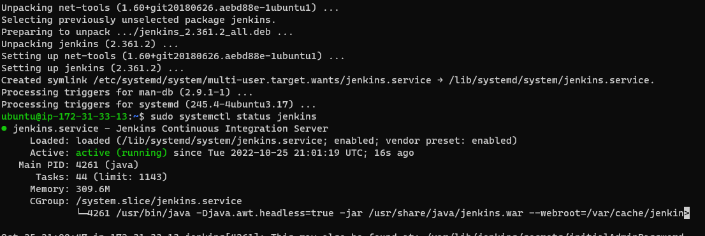
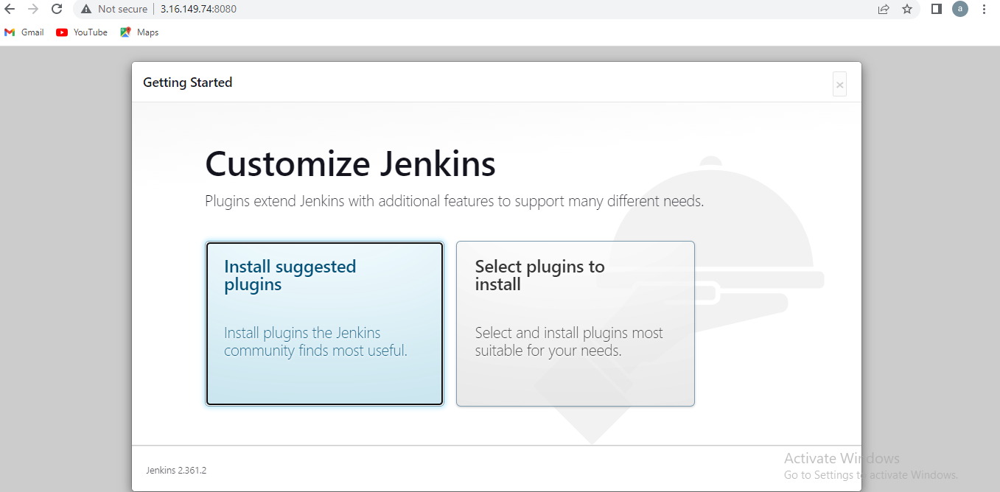
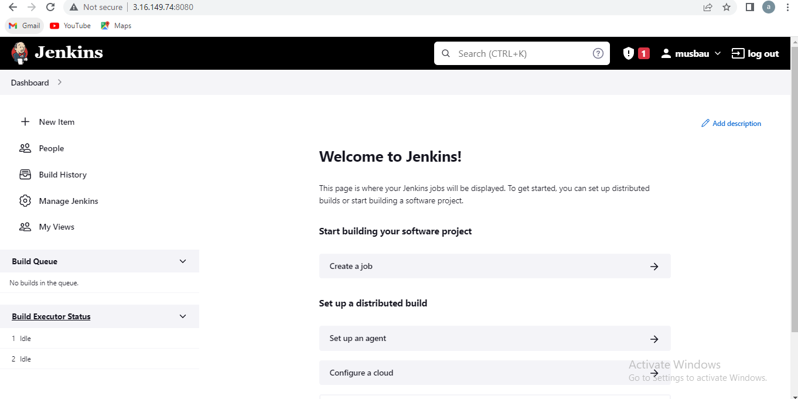
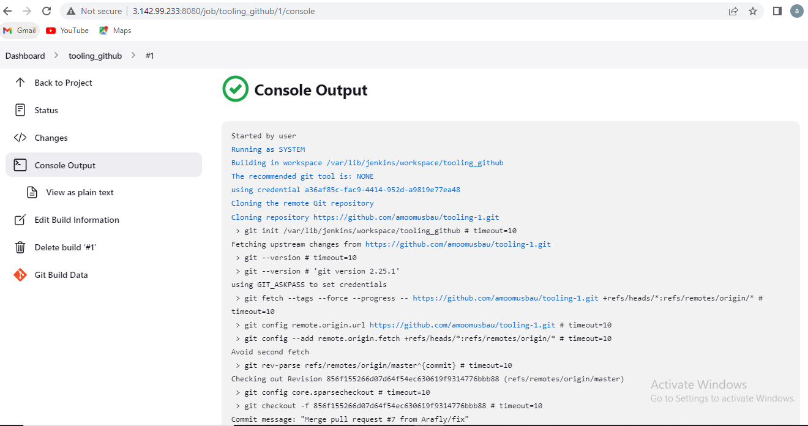
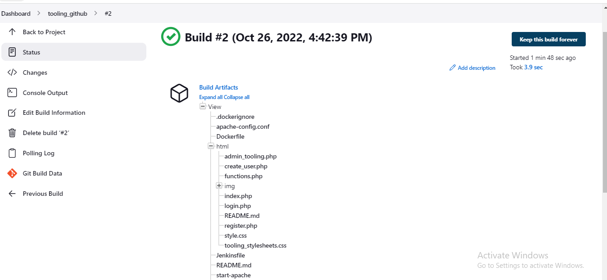
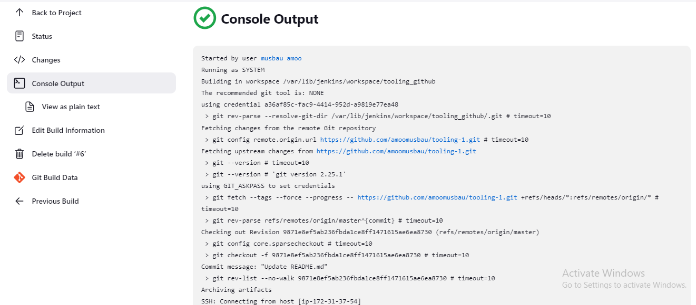
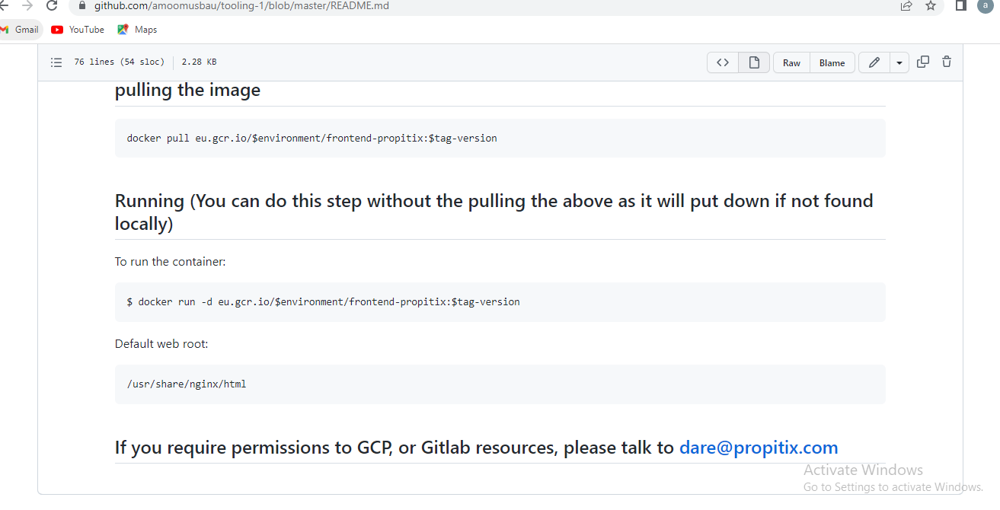
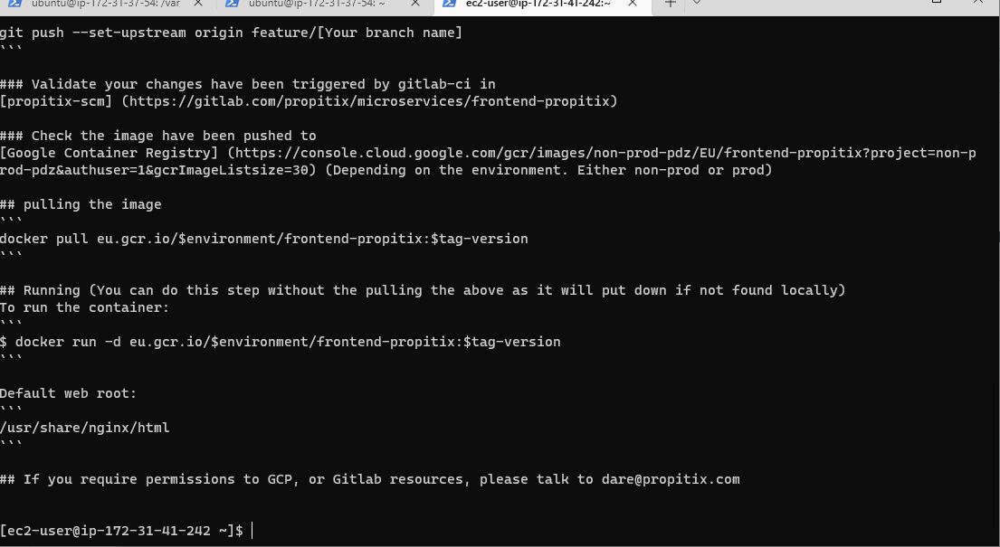

**TOOLING WEBSITE DEPLOYMENT AUTOMATION WITH CONTINUOUS INTEGRATION. INTRODUCTION TO JENKINS**

**Install Jenkins server**

****

** Jenkins up and running**

****

****

**Configure Jenkins to retrieve source codes from GitHub using Webhooks**

****

**Built Artifats**

****

**Webhook  trigger a new job and in the "Console Output"**

****

**To make sure that the files in /mnt/apps have been udated – i connect via SSH/Putty to your NFS server and check README.MD file**

**github readme**

****

**same changes in github and nfs**

****

